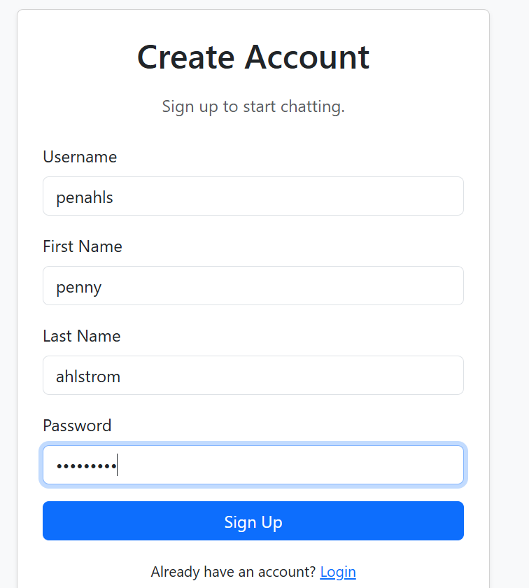
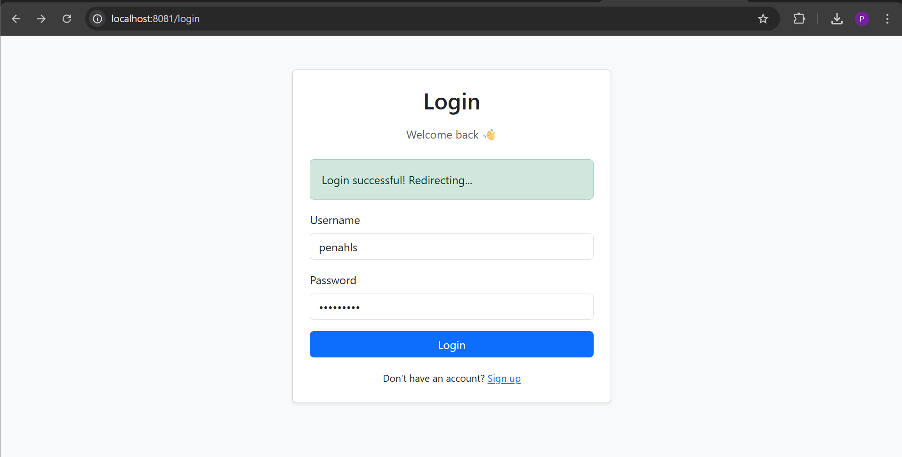
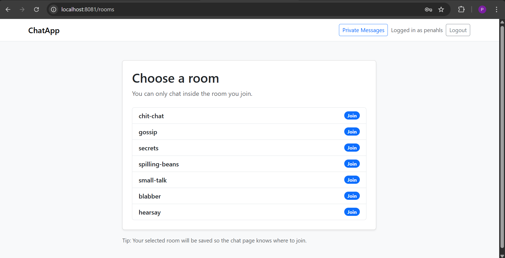
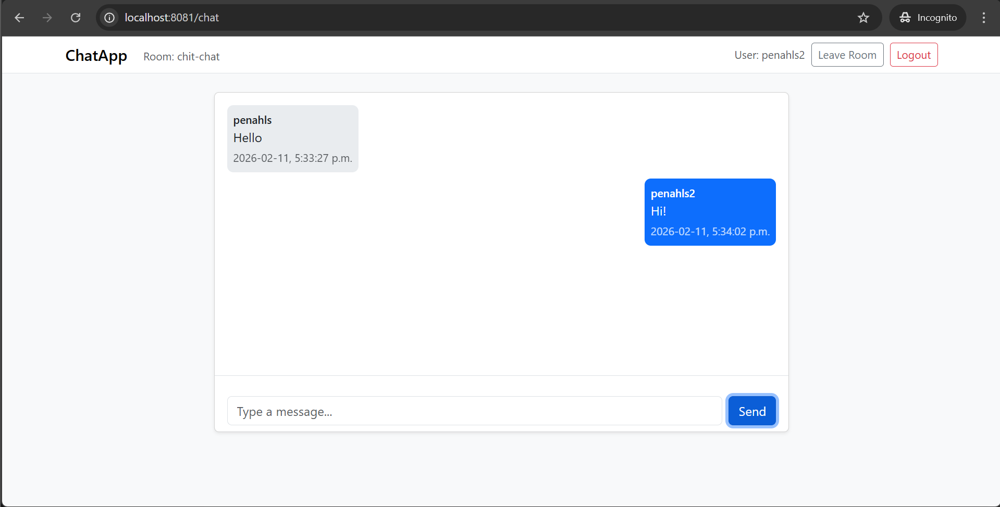
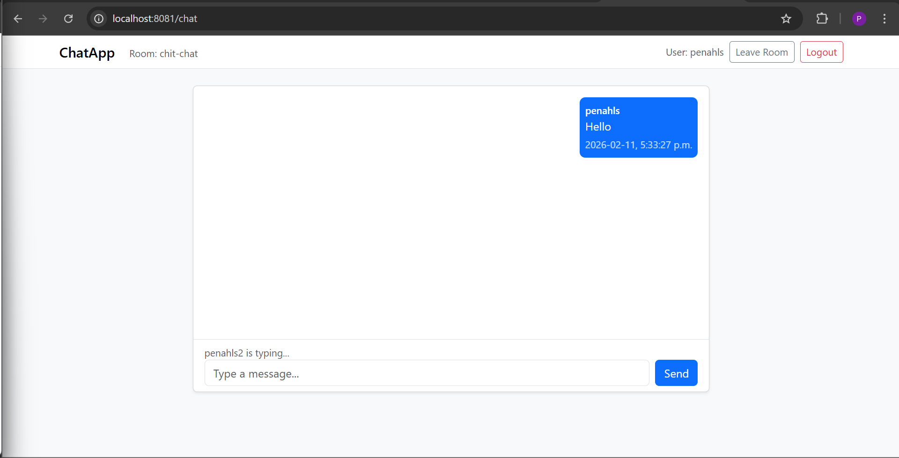
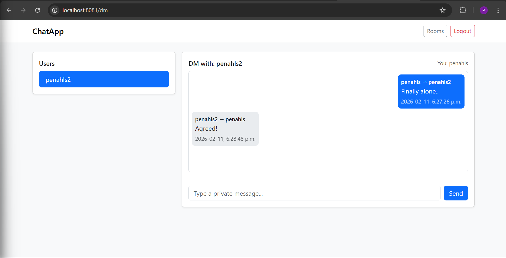
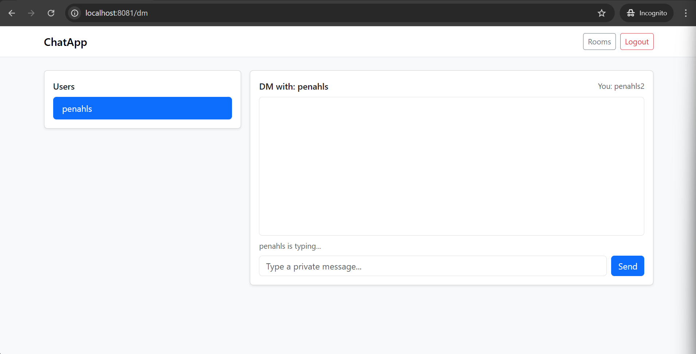
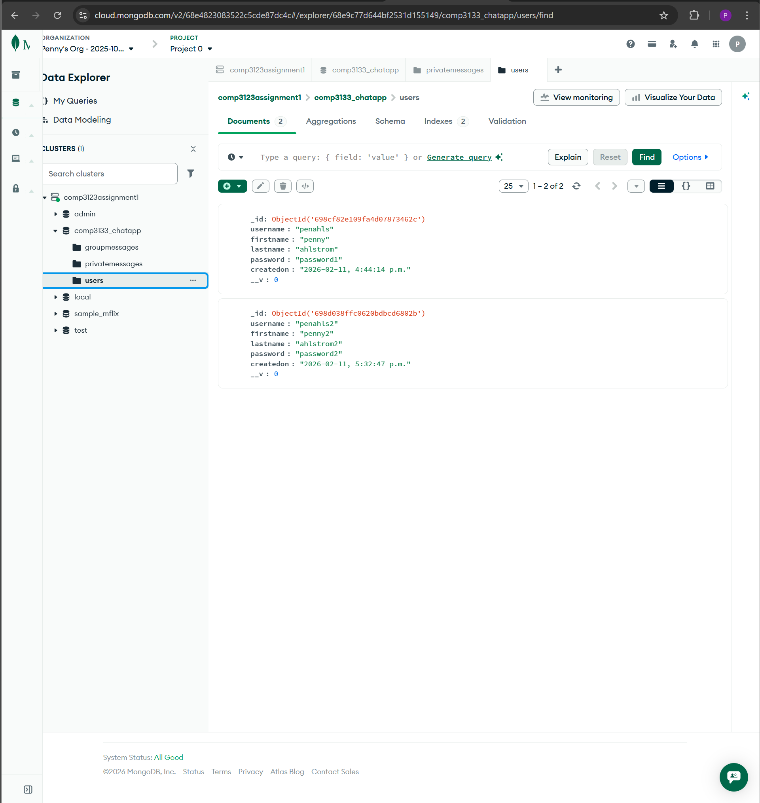
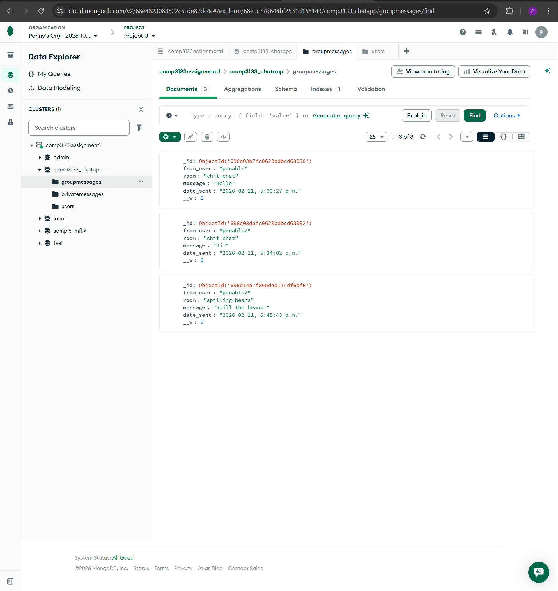
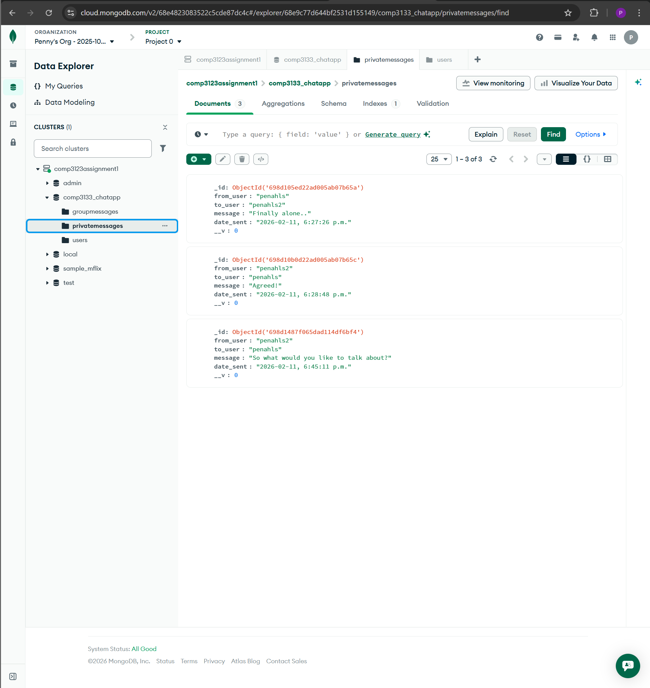

# Real-Time Chat Application (Socket.io + Express + MongoDB)

A real-time chat application built using **Node.js, Express, Socket.io, and MongoDB (Atlas)**.  
The app supports **user authentication**, **room-based group messaging**, **private messaging (DMs)**, **typing indicators**, and **message persistence**.

---

## Features

### ✅ Authentication
- Signup page stores user information in MongoDB
- Login page authenticates users
- Session stored in `localStorage`

### ✅ Room-Based Messaging
- Users can join one room at a time from a predefined list
- Messages are only sent/received within the room the user joined
- Users can leave a room and return to the room selection page

### ✅ Private Messaging (DM)
- Users can send private messages to other users
- Private messages are real-time and stored in MongoDB
- A user list is available for selecting DM recipients

### ✅ Message Persistence (MongoDB)
- Group (room) messages are stored in MongoDB
- Private messages are stored in MongoDB
- Previous messages are loaded when the user enters a room or DM chat

### ✅ Typing Indicator
- Displays “User is typing...” in both room chat and private messages

### ✅ Logout
- Clears localStorage session and redirects to login page

---

## Technologies Used

### Backend
- Node.js
- Express.js
- Socket.io
- MongoDB Atlas
- Mongoose

### Frontend
- HTML5
- CSS
- Bootstrap 5
- JavaScript (fetch API)

---

## Setup Instructions

### 1 Clone the repository
git clone https://github.com/PennyAhlstrom/101488485_lab_test1_chat_app.git
cd your-file-path

### 2 Install dependencies
npm install

### 3 Create a .env file
Create a .env file in the root directory based on the .env.example file

### 4 Run the application
npm run dev

The server will start at:
http://localhost:8081

---

## How to Use the App
### Signup
Go to:
http://localhost:8081/signup

Create a new account

### Login
Go to:
http://localhost:8081/login

Login with your account

### Join a Room
After login, you will be redirected to the Rooms page

Select a predefined room to enter the group chat

### Group Chat
Send and receive real-time messages inside your room

Messages are stored in MongoDB and will reload on refresh

### Private Messages (DM)
Click the Private Messages button in the navbar

Select a user from the list and send private messages

Private messages are stored in MongoDB

### Logout
Click Logout to clear session and return to login page

---

## Screenshots

### 1 Signup Page

### 2 Login Page

### 3 Rooms Page (Room Selection)

### 4 Room Chat Page

### 5 Typing Indicator (Room Chat)

### 6 Private Messages Page (User List + DM Chat)

### 7 Typing Indicator (Private Messages)

### 8 MongoDB Atlas Collections

### 9 MongoDB Group Message

### 10 MongoDB Private Message

---